# RESPAK ERP — Enterprise Architecture

> Multi-project ERP for **RESPAK Construction (Pvt) Ltd.**
> Scope: Construction, Real Estate, Supply Works, Solarization + future categories.
> Stack: **Next.js 15 (App Router, full-stack) · Node.js · TypeScript · Prisma · MySQL · Tailwind + Ant Design-ready · Auth.js (NextAuth v5)**

This document describes the complete architecture: multi-project design, database schema & ERD, API structure, RBAC, approval workflow, document control, ISO compliance, auto reference numbering, state management, security, and the scalability roadmap.

---

## 1. Multi-Project Architecture

Every project is a first-class entity. All operational data (BOQ, budget, progress, MR, PO, GRN, cost, DPR, IPC, documents, NCR) is **scoped to `projectId`**. There are **no global operational records** — this is what makes the ERP "multi-project".

```
                 ┌──────────────────────────────────────────────┐
                 │                PROJECT (PRJ-001)             │
                 │  category, budget, status, manager, client    │
                 └──────────────────────────────────────────────┘
      ┌────────────┬──────────────┬──────────────┬──────────────┐
      ▼            ▼              ▼              ▼              ▼
   BOQ tree    Activities      Budget        Material Req    Cost Logs
   +rate       +progress      +lines         → PO → GRN      budget vs
   analysis    (S-curve)      (by cost type)  → Issue        actual
   └── IPC     └── labor      └── alerts      └── stock       └── VO
```

- **Project categories**: `CONSTRUCTION`, `REAL_ESTATE`, `SUPPLY_WORKS`, `SOLARIZATION`, `OTHER` (open enum — new categories are data, not code).
- **Project switching**: a global `ActiveProject` context (client-side) + `?project=` filter in every module; server queries always filter by `projectId`.
- **Project dashboards & KPIs**: per-project budget/actual/variance, % progress, open alerts/NCR/incidents — computed by `projectKpis()`.

### Project-wise user access
Access = **global RBAC role** (can read module X) **AND** optional **project assignment** (which projects / what level):

```
ProjectUser { projectId, userId, role: VIEWER | EDITOR | APPROVER | MANAGER }
```

A user with `projects:read` permission but no assignment sees only their assigned projects (or all, if they hold `SUPER_ADMIN`/`ADMIN`). Enforced in the `requireProjectAccess()` server guard (below).

---

## 2. Database Schema & ERD

Full schema lives in [`prisma/schema.prisma`](./prisma/schema.prisma). ~55 tables grouped by module:

```
Core / RBAC          User, Role, Permission, UserRole, RolePermission, AuditLog
Approval Engine      ApprovalChain, ApprovalStep, ApprovalRequest, ApprovalAction
Multi-Project        Project (category), ProjectUser, Client, ClientContract
BOQ                 BOQ, BOQItem (tree), RateAnalysis, RateAnalysisLine
Progress            Activity (tree), ActivityProgress, ProjectProgress (S-curve),
                    LaborLog, Equipment, EquipmentUsageLog
Budget / Cost       Budget, BudgetLine, CostAlert, CostCenter, CostLog,
                    VariationOrder, IPC, IPCLine
Procurement/Stock   PurchaseRequisition, PurchaseOrder, GRN, MaterialRequest,
                    MaterialIssue, Item, ItemCategory, Warehouse, StockLevel,
                    StockTransaction, SupplierInvoice, Vendor…
Finance             Account, JournalEntry(+Line), Payment, ClientInvoice(+Line)
HR & Payroll        Employee, Department, Designation, Attendance, LeaveRequest,
                    PayrollRun, PayrollItem
Vehicles            Vehicle, VehicleTrip, FuelLog, VehicleMaintenance, VehicleLocation
Site / Doc Ctrl     DPR, CheckRequest, Submittal, Transmittal, Attachment
Correspondence      Correspondence (LETTER_IN / LETTER_OUT / INTERNAL_MEMO)
Document Control    DocumentCategory, Document (versioned), DocumentVersion
ISO Compliance      NCR, CorrectiveAction, RiskAssessment, TrainingRecord,
                    EnvironmentalAspect, SafetyIncident
Numbering           NumberingConfig, NumberingCounter
```

### Core ERD

```mermaid
erDiagram
    PROJECT ||--o{ BOQ : has
    BOQ ||--o{ BOQITEM : contains
    BOQITEM ||--o| RATEANALYSIS : "rate analysis"
    BOQITEM ||--o{ BOQITEM : "parent/child"
    BOQITEM ||--o{ IPCLINE : measured
    IPC ||--o{ IPCLINE : contains
    PROJECT ||--o{ ACTIVITY : plans
    ACTIVITY ||--o{ ACTIVITYPROGRESS : reports
    ACTIVITY ||--o{ LABORLOG : deploys
    PROJECT ||--o{ PROJECTPROGRESS : "S-curve"
    PROJECT ||--o{ BUDGET : plans
    BUDGET ||--o{ BUDGETLINE : "by BOQ/activity/costType"
    PROJECT ||--o{ COSTLOG : "actual costs"
    BUDGETLINE ||--o{ COSTALERT : triggers
    PROJECT ||--o{ MATERIALREQUEST : raises
    MATERIALREQUEST ||--o{ MATERIALREQUESTITEM : contains
    MATERIALREQUEST ||--o{ MATERIALISSUE : "fulfilled by"
    MATERIALISSUE ||--o{ MATERIALISSUEITEM : contains
    PROJECT ||--o{ CORRESPONDENCE : "letters/memos"
    PROJECT ||--o{ DOCUMENT : "controlled docs"
    DOCUMENT ||--o{ DOCUMENTVERSION : "version history"
    PROJECT ||--o{ NCR : reports
    NCR ||--o{ CORRECTIVEACTION : "CAPA"
    PROJECT ||--o{ RISKASSESSMENT : assesses
    PROJECT ||--o{ ENVIRONMENTALASPECT : registers
    PROJECT ||--o{ SAFETYINCIDENT : records
    APPROVALCHAIN ||--o{ APPROVALSTEP : "ordered steps"
    APPROVALREQUEST ||--o{ APPROVALACTION : "history"
    NUMBERINGCONFIG ||--o{ NUMBERINGCOUNTER : "per project/year"
    PROJECT ||--o{ PROJECTUSER : "user assignment"
    USER ||--o{ PROJECTUSER : "access"
```



All transactional tables (`PO`, `GRN`, `MR`, `IPC`, `VO`, `NCR`, `SafetyIncident`, DPR, …) carry an optional `approvalRequestId` link to the **generic approval engine** (polymorphic: `ApprovalRequest.entityType + entityId`).

---

## 3. Auto Reference Number System

**Config-driven, atomic, collision-free.**

Format: `PREFIX / PROJECT CODE / YEAR / SERIAL` — e.g. `MR / PRJ-001 / 2026 / 0001`

```ts
// src/server/refno/service.ts
export async function generateRefNo(docType: string, opts?: { projectCode?: string; year?: number }): Promise<string> {
  const config = await prisma.numberingConfig.findUnique({ where: { docType } });
  if (!config || !config.isActive) throw new Error(`Numbering not configured for ${docType}`);
  const year = opts?.year ?? new Date().getFullYear();
  const projectCode = opts?.projectCode || "GEN";

  const serial = await prisma.$transaction(async (tx) => {
    const existing = await tx.numberingCounter.findUnique({
      where: { configId_projectCode_year: { configId: config.id, projectCode, year } },
    });
    const next = existing ? existing.lastSerial + 1 : config.startSerial;
    if (existing) await tx.numberingCounter.update({ where: { id: existing.id }, data: { lastSerial: next } });
    else await tx.numberingCounter.create({ data: { configId: config.id, projectCode, year, lastSerial: next } });
    return next;
  });

  const parts = [config.prefix];
  if (config.includeProjectCode) parts.push(projectCode);
  if (config.includeYear) parts.push(String(year));
  parts.push(String(serial).padStart(config.padLength, "0"));
  return parts.join(config.separator || "/");
}
```

- Per-(config, project, year) counter rows inside a DB transaction ⇒ no duplicate numbers under concurrency.
- Every new transaction calls `generateRefNo(docType, { projectCode })` at creation and stores the result in its `xxxNo` unique column.

---

## 4. Folder Structure

```
d:\ERP BY WAQAR
├── prisma/
│   ├── schema.prisma          # ~55 tables, full ERP schema
│   └── seed.ts                # roles, perms, numbering configs, demo data
├── src/
│   ├── middleware.ts          # Edge-safe auth gate (Auth.js config split)
│   ├── lib/
│   │   ├── auth.ts            # NextAuth + Credentials + JWT (Node runtime)
│   │   ├── auth.config.ts     # Edge-safe config for middleware
│   │   ├── db.ts              # Prisma singleton
│   │   ├── permissions.ts     # requirePermission / apiRequirePermission
│   │   ├── constants.ts       # modules, permission keys, approval map, ref doc types
│   │   ├── api.ts             # ok/fail/forbidden helpers
│   │   └── utils.ts           # formatters, doc-number helper
│   ├── server/
│   │   ├── refno/             # ⭐ configurable reference-number engine
│   │   ├── approval/          # ⭐ generic approval engine
│   │   ├── audit.ts           # audit log
│   │   ├── projects/          # multi-project + KPIs + project access
│   │   ├── boq/               # BOQ + rate analysis
│   │   ├── progress/          # activities, S-curve, labor, equipment
│   │   ├── budget/            # budget lines, budget-vs-actual, alerts
│   │   ├── cost/              # cost centers, cost logs, VO, IPC
│   │   ├── materials/         # MR workflow + issue → stock & cost
│   │   ├── documents/         # document control (versioned)
│   │   ├── iso/               # NCR, CAPA, risk, training, env, safety
│   │   ├── correspondence/    # letters in/out, memos
│   │   └── <existing modules> # procurement, inventory, finance, hr…
│   ├── components/
│   │   ├── ui/                # primitives
│   │   ├── layout/            # sidebar (module nav), topbar
│   │   ├── project-context.tsx# ActiveProject provider (React context)
│   │   └── <module>/          # forms & views
│   └── app/
│       ├── (auth)/login/
│       ├── (dashboard)/
│       │   ├── projects/            # project register + project dashboard
│       │   ├── projects/[id]/       # project workspace (switch context)
│       │   ├── boq/ … progress/ … budget/ … cost/ … documents/ … iso/ … correspondence/
│       │   └── <existing modules>
│       └── api/               # REST API per resource
└── README.md  ·  ARCHITECTURE.md
```

---

## 5. RBAC Design

**Two layers:**

| Layer | Where | What it controls |
|---|---|---|
| 1. Global role → permissions | `Role` ↔ `Permission` (`module:action`) | Can the user see/act on a module at all |
| 2. Project assignment | `ProjectUser` (role per project) | Which projects + level (view/edit/approve/manage) |

- **Permissions**: `read`, `create`, `update`, `delete`, `approve` × each module (`projects`, `boq`, `progress`, `budget`, `cost`, `documents`, `iso`, `correspondence`, …).
- **Guard helpers** (server components & API):

```ts
// page (server component)
const user = await requirePermission(PERMISSIONS.BOQ_READ);

// project-scoped page
const project = await requireProjectAccess(user, projectId, "EDITOR");

// API route
const user = await apiRequirePermission(PERMISSIONS.ISO_CREATE);
```

- **Approvals** are separate from edit permissions: `module:approve` is granted only to managers/HO.
- JWT carries `roles` + `permissions` (set at login) so middleware & guards never hit the DB on the hot path.

---

## 6. Approval Workflow

Generic engine (`src/server/approval/service.ts`) shared by every approval-required transaction.

```
DRAFT ──submit──▶ PENDING ──step-1 approve──▶ PENDING(step 2) ──▶ APPROVED
                     │                                              ▲
                     └──────────── reject ──────────────────────────┘
                                                    (REJECTED → re-editable)
```

- Chains are configured in **Settings → Approval Workflows** (`ApprovalChain` + ordered `ApprovalStep` by role/user).
- `ENTITY_STATUS_MAP` links `entityType` → Prisma model + status field, so the engine flips the source record's status on approve/reject (e.g. `MR → APPROVED`, `IPC → CERTIFIED`, `SafetyIncident → COMPLETED`).
- If no chain exists for a type, documents **auto-approve**.

---

## 7. Module Designs (backend logic + API + UI)

> Each module follows the same pattern: **server service** (business logic + Prisma) → **REST API route** (guard + validate) → **server-component list page** + **client form**.

### 7.1 BOQ Management (`/boq`)
- **Logic**: `createBoq()` (ref no `BOQ/PRJ-xxx/001`) → `addBoqItem()` (tree via `parentId`, amount = qty × rate) → `saveRateAnalysis()` auto-computes rate:

```
baseCost = Σ materials + Σ labor + Σ equipment
rate     = baseCost × (1 + overhead% + profit%) / quantity
```

- **API**: `GET/POST /api/boq`, `POST /api/boq/:id/items`, `POST /api/boq/items/:id/rate-analysis`, `POST /api/boq/items/:id/approve`
- **UI**: BOQ list → BOQ detail (indented item tree) → item editor with rate-analysis table (MATERIAL/LABOR/EQUIPMENT rows), live computed rate.

### 7.2 Progress Mechanism (`/progress`)
- **Models**: `Activity` (WBS tree) → `ActivityProgress` (planned vs actual per date) → `ProjectProgress` (S-curve points) → `LaborLog` + `EquipmentUsageLog`.
- **S-curve / Gantt data**: `ProjectProgress` provides (date, planned %, actual %) — a charting endpoint returns the series; activities carry `startDate/endDate` for Gantt bars.
- **API**: `GET/POST /api/projects/:id/activities`, `/api/projects/:id/progress`, `/api/projects/:id/labor`, `/api/projects/:id/equipment-usage`.
- **UI**: activity Gantt + S-curve (plotted client-side from the API series), daily progress entry, photos via `Attachment` (refType `PROGRESS`/`SITE_REPORT`).

### 7.3 Budgeting (`/budget`)
- `Budget` → `BudgetLine (by BOQItem | Activity | CostType | Account)`.
- **Budget vs actual**: compare `BudgetLine.amount` vs `CostLog.amount` grouped by the same dimension. A scheduled job (or on-post hook) creates `CostAlert` when actual ≥ threshold% (default 100%).
- **API**: `GET/POST /api/projects/:id/budgets`, `GET /api/projects/:id/budget-vs-actual`, `GET/POST /api/projects/:id/cost-alerts`.
- **UI**: budget table, variance bars, alert list with resolve action, multi-project comparison chart.

### 7.4 Cost Control (`/cost`)
- `CostCenter` tree → `CostLog` (date, costType, amount, refType/refId). Every PO/GRN/MR-issue/payroll can post a `CostLog` — single source of truth for actuals.
- `VariationOrder` (approval) adjusts contract value; `IPC` (approval → CERTIFIED) bills measured BOQ quantities to the client, respecting retention/deductions.
- **API**: `GET/POST /api/projects/:id/cost-centers`, `/cost-logs`, `/variation-orders`, `/ipc`.
- **UI**: cost dashboard (actual vs budget by costType), VO register, IPC generator (pick BOQ lines + measured qty → computes net).

### 7.5 Procurement & Inventory (project-wise)
- `MaterialRequest` (ref `MR/PRJ/yyyy/0001`, approval) → optional `PurchaseOrder` → `GRN` (stock-in) → `MaterialIssue` (stock-out to project, posts `CostLog` + `StockTransaction`).
- **API**: `GET/POST /api/projects/:id/material-requests`, `POST …/:id/submit`, `POST /api/projects/:id/issues`.
- **UI**: MR list + issue screen showing available stock per item.

### 7.6 Document Control (`/documents`) — ISO-ready
- `DocumentCategory` (POLICY/PROCEDURE/SOP/FORM/RECORD/MANUAL × module QUALITY/ENVIRONMENT/SAFETY/HR/…).
- `Document` (status: DRAFT→UNDER_REVIEW→APPROVED→OBSOLETE, `effectiveDate`, `expiryDate`, `isoStandard`) + immutable `DocumentVersion` history; `currentVersion` pointer.
- **API**: `GET/POST /api/documents`, `POST /api/documents/:id/versions`, `GET /api/documents/expiring?days=30`.
- **UI**: repository with filters, version timeline, expiry alerts.

### 7.7 ISO Compliance (`/iso`)
- **NCR** → **CorrectiveAction (CAPA)** workflow, **RiskAssessment** (likelihood × severity), **TrainingRecord** (competency/expiry), **EnvironmentalAspect** register, **SafetyIncident** investigation workflow.
- Evidence = files/photos via `Attachment` (refType `NCR`/`CAPA`) → audit-ready.
- **API**: CRUD per ISO entity; NCR/incident support submit/approve.
- **UI**: ISO dashboard with counts, NCR register + CAPA board, risk register heat-map, training expiry list, incident log.

### 7.8 Correspondence (`/correspondence`)
- `Correspondence` with `LETTER_IN/LETTER_OUT/INTERNAL_MEMO`, auto ref (`LI/LO/IM`), attachments.
- **API**: `GET/POST /api/correspondence`, `GET /api/correspondence/:id`.

---

## 8. State Management Plan

| Layer | Choice | Why |
|---|---|---|
| Server state (lists/queries) | **Server Components** (RSC) querying Prisma directly | Fast, no client round-trip |
| Server mutations | **REST API** (`fetch`) via a small `useSubmit` hook | API-first (matches the "no API in old ERP" driver), easy to swap to server actions |
| Client state (form inputs) | Local `useState` | Simple, scoped |
| Global UI state | **Zustand** (recommended addition): `activeProject`, `sidebar`, `toast` | Lightweight, no boilerplate |
| Remote caching (optional) | **TanStack Query** for dashboard/KPI polling | Auto-refetch, optimistic updates |

Recommendation: add **Zustand** for `activeProject` (project switcher) and **TanStack Query** only for dashboard widgets that need polling.

---

## 9. Security, Scalability & Performance

**Security**
- Argon2/bcrypt hashing; JWT sessions (8h) with roles/permissions embedded; `AUTH_SECRET` from env.
- Edge-safe middleware (Prisma/bcrypt never bundled into Edge).
- Every API route re-checks `apiRequirePermission`; project-scoped routes use `requireProjectAccess`.
- Zod validation on all inputs (planned); Prisma parameterized queries prevent SQL injection.
- Audit log on create/update/approve/reject; `NEXTAUTH_URL` + HTTPS in production.

**Performance**
- Indexes on all `projectId`, `status`, `date`, `refNo` columns (defined in schema).
- Read-heavy list pages are RSC (no client waterfall); pagination via `take/skip`.
- Prisma `select` projections avoid over-fetching.
- Numbering counters are atomic transactions (no duplicates, minimal lock scope).

**Scalability (roadmap)**
- **Caching**: Redis for KPI aggregates + session/rate-limit; consider Prisma Accelerate.
- **Logs**: structured logging (pino) + request IDs; integrate with the `AuditLog` table.
- **Async jobs**: budget-vs-actual alerts, document expiry, payroll generation as a queue (BullMQ) instead of inline.
- **Microservices (optional, later)**: split heavy domains (Finance, Vehicle/GPS, Reports) into services behind the Next.js API gateway only when team + traffic justify it — the service-layer boundary (`src/server/<module>`) is already the seam for extraction.
- **Multi-company**: `Company` model exists; add `companyId` to `Project`/`User` when branches scale.
- **File storage**: replace inline URLs with S3-compatible storage (uploads endpoint + signed URLs); `Attachment`/`DocumentVersion.fileUrl` already abstract it.

---

## 10. Suggested Implementation Order

1. ✅ Schema + numbering engine + services (done)
2. Projects module UI (register, project dashboard, switcher)
3. BOQ UI (tree editor + rate analysis)
4. Progress UI (activities, S-curve, DPR integration)
5. Budget & Cost Control UI (budget editor, cost logs, alerts, VO, IPC)
6. Material Request & Issue UI (wire into existing procurement/inventory)
7. Document Control UI (repository + versions + expiry alerts)
8. ISO module UI (NCR/CAPA, risk, training, environment, safety)
9. Correspondence UI + report/export layer
